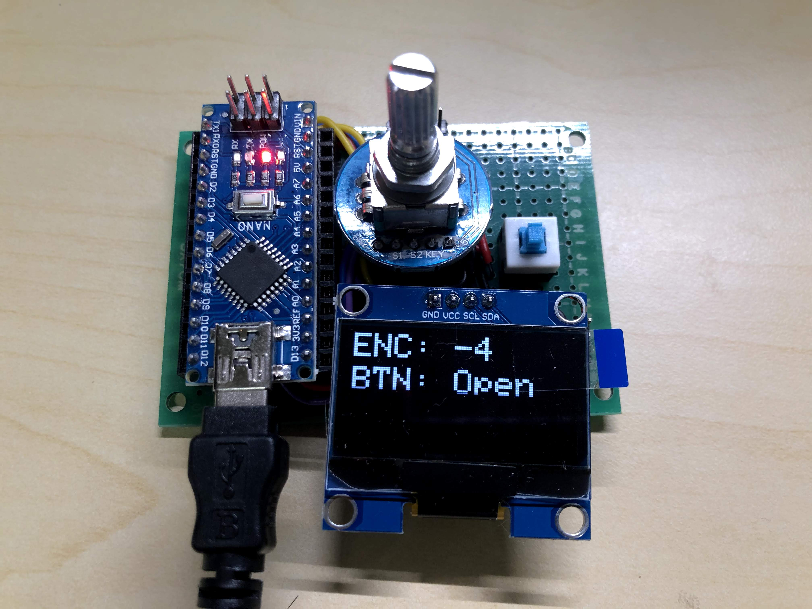

# Notched Shaft Encoder with button support

## Introduction

This library provides an easy to use interface for the programmer to drive a Notched Shaft type of Encoder with button support. The driver operates in high accuracy and high performance for encoder position monitoring.

It inheritance from [PaulStoffregen / Encoder](https://github.com/PaulStoffregen/Encoder) library and extend the feature especially for a Notched Shaft Encoder.

## Feature

There have 2 difference classes which are NSEncoder and NSEncoder_btn. NSEncoder class provides a normal encoder monitoring feature. NSEncoder_btn class provides a normal encoder monitoring and a button press detection feature.

### Encoder feature

The NSEncoder provides the same performance as [PaulStoffregen / Encoder] with an additional stepsPerNotch feature. You can attach the encoder pin (A/B) to a digital I/O with external Interrupt feature to enhance the performance and reduce the MCU execution time. The initialization procedure is the same as the [PaulStoffregen / Encoder] library.

Some of the Notched Shaft Encoder will generate a 2/4 pulse per 1 notch indent of rotation. It depends on the encoder's hardware design. To ensure the correctness of the encoder position monitoring, you can change the parameter `stepsPerNotch` to an appropriate value.

### Button feature

Inspired by [0xPIT / Encoder](https://github.com/0xPIT/encoder), this NSEncoder_btn also provide multiple button states including `PRESSED`, `DOUBLE_PRESSED`, `HELD`.

The button detection feature use a Timer to monitoring the button status. Increase the value of the debouncing interval in the driver can reduce the number of Timer ISR execution calls. This can increase the MCU performance.

You can disable the `Double Press` detection feature to gain a small performance boost. NSEncoder_btn will not listening the `Double Press` action after a normal `Press`. It can speed up the response time of the button and make the button more responsive.

## How to Use

Review the Example

## Reference
https://github.com/PaulStoffregen/Encoder
https://github.com/0xPIT/encoder